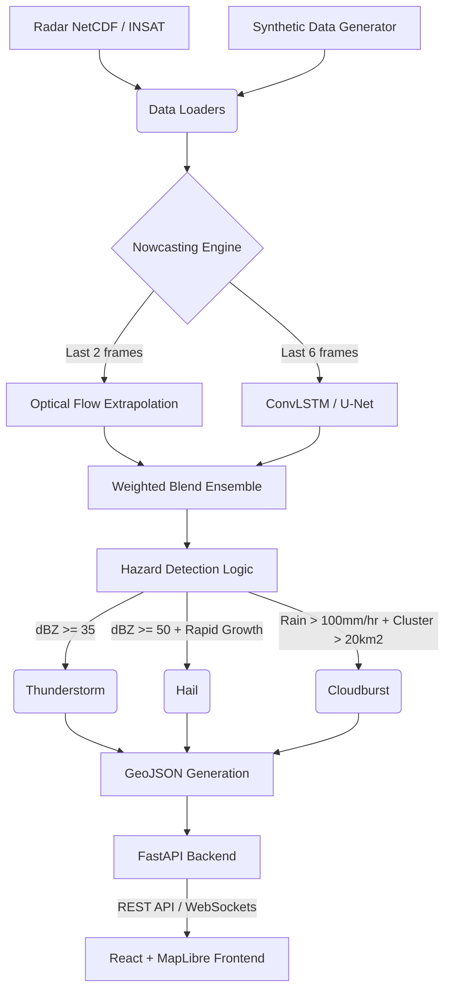

# SIH 26084: Convective-scale Nowcasting Prototype

## Architecture Diagram

## Data Sources
- **Synthetic Data**: Moving Gaussian convective cells, generated offline via `synthetic.py`.
- **Radar**: Supports NPY arrays and NetCDF formats.

## Limitations
- **Current Data**: Uses synthetic data for the prototype demo due to lack of immediate API keys / live radar feeds.
- **ML Model**: Uses a dummy ConvLSTM structure; needs training on actual DWR (Doppler Weather Radar) sequences for production.
- **Elevation Data**: Cloudburst detection currently uses rain rate, but incorporating topography (DEM) would significantly improve accuracy in hilly regions.

## Future Scope
1. **Real IMD DWR Integration**: Hook into real-time radar data feeds.
2. **Mobile Alerts**: Integrate SMS or Common Alerting Protocol (CAP) integrations for citizens.
3. **NWP Assimilation**: Blend radar extrapolation with WRF (Weather Research and Forecasting) model outputs.
4. **Edge Deployment**: Optimize the ML model using TensorRT to run on edge servers at local meteorological centers.
